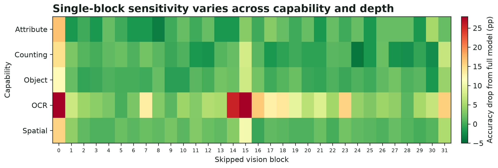

# Searching for Task-Specific Vision Paths

## Abstract

## 1. Introduction

Vision-language models (VLMs) have become a dominant paradigm for multimodal AI. Guided by scaling laws and advances in multimodal pretraining, VLMs have become increasingly powerful, but they have also become expensive to deploy [@kaplan2020scaling; @hoffmann2022training; @bai2025qwen25vl]. Unlike language-only models, a VLM must first convert an image into visual tokens and process them through a vision encoder before generating an answer. Every question normally executes the same complete stack of vision blocks, even when the visual information requested by the question is very different.

Capabilities like OCR, counting, and spatial reasoning may not require identical computation. This raises a simple question: does every capability need every vision block? If some vision blocks are redundant for a given input, replacing them with identity operations could reduce executed vision depth without introducing sparse kernels or changing the language decoder. However, a block that looks safe to skip by itself may not remain safe when several blocks are skipped together because residual blocks interact.

Existing efficiency work has explored quantization, structured layer pruning, and visual-token reduction. Layer-pruning methods such as ShortGPT and SliceGPT reduce depth or width in language models [@men2024shortgpt; @ashkboos2024slicegpt], while DynamicViT, Token Merging, SparseVLM, and VScan reduce the number of visual tokens processed by transformers [@rao2021dynamicvit; @bolya2023tome; @zhang2025sparsevlm; @zhang2025vscan]. Short-LVLM directly studies training-free layer pruning in large vision-language models, but searches for one generally compressed model [@ma2025shortlvlm]. It therefore remains unclear whether the best removable *vision-encoder* blocks depend on the requested visual capability, and whether independently measured block importance composes when several blocks are skipped together.

We study two questions:

1. At the same number of skipped blocks, can combinatorial search find stronger routes than independent ranking, contiguous removal, or random selection?
2. Can capability-specific routes outperform one shared route across OCR, counting, object, attribute, and spatial questions?

A route is a set of exactly `K` vision-transformer blocks replaced by identity operations. A shared K-block route skips the same blocks for every question, while a capability-specific K-block policy uses one same-size route for each known capability label. We search for the best routes found under a frozen evolutionary procedure rather than claiming a global optimum. All comparisons use matched pruning budgets, meaning every compared route skips exactly the same number of blocks.

We use Qwen2.5-VL-3B-Instruct as the primary model and SmolVLM2-2.2B-Instruct as a second architecture. Our dataset covers five visual capabilities: OCR, counting, object existence, attributes, and spatial relationships. We first measure the sensitivity of every vision block independently, then use source-balanced evolutionary search to construct shared and capability-specific routes at matched skip budgets. The evaluation separates route search, image-disjoint method selection, matched controls, and a post-freeze IIIT5K source-transfer test.

We find that evolutionary search consistently constructs stronger routes than naive block selection, but capability-specific routing is not universally better. On Qwen, the capability-specific six-block policy is 2.17 percentage points above the shared six-block route, driven by a 7.10-point OCR gain. On SmolVLM2, evolutionary search still helps: the searched shared four-block route beats independent construction by 4.91 points. However, its capability-specific policy is only 0.80 points better overall because counting and spatial gains are offset by a 13.55-point OCR loss. On sealed IIIT5K, the Smol OCR-specific route falls another 13.6 points below the shared route. These results suggest that route construction is genuinely combinatorial, but capability labels alone do not define stable or transferable vision pathways.

Our contributions are:

1. A source-balanced evolutionary procedure for searching fixed-budget vision-block routes.
2. A matched-budget study across two VLM architectures and five visual capabilities.
3. A capability-level, cross-model, and source-transfer analysis showing both the potential and limitations of capability-specific routing.

*Figure 1. Accuracy drop after replacing one Qwen2.5-VL-3B vision block at a time with identity. Many block-capability cells show limited damage when skipped alone, but sensitivity varies by capability and depth. This is screening evidence: a low single-block drop does not imply that several such blocks can be safely combined or that a capability is stored in a specific block.*

## 2. Motivation

### 2.1 Are individual vision blocks redundant?
### 2.2 Why independent block rankings do not compose
### 2.3 Why route selection is a combinatorial problem

## 3. Methodology

### 3.1 Identity block skipping
### 3.2 Shared and capability-specific routes
### 3.3 Source-balanced objectives
### 3.4 Evolutionary route search
### 3.5 Finalist selection and matched controls

## 4. Experiments

### 4.1 Models, datasets, and metrics
### 4.2 Does evolutionary search beat naive pruning?
### 4.3 Does capability-specific routing help?
### 4.4 Does the result replicate across models?
### 4.5 Does an OCR-specific route transfer to IIIT5K?
### 4.6 Efficiency and route stability

## 5. Limitations

## 6. Related Work

## 7. Conclusion

## References
